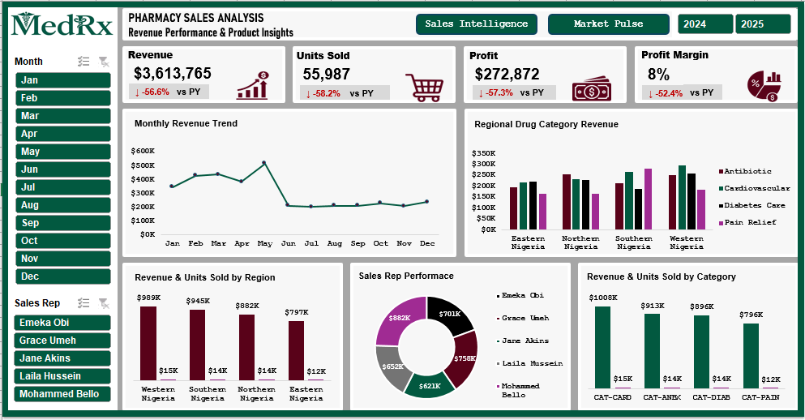
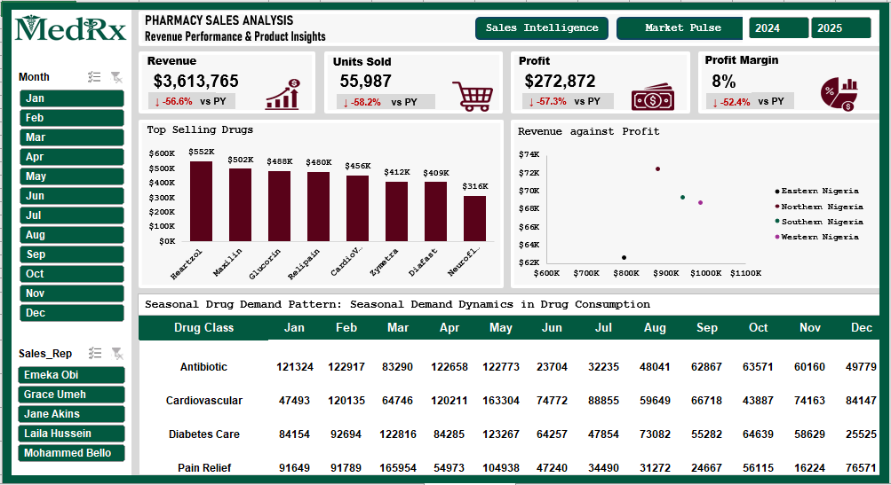

# MedRx Pharmacy Sales Analysis Dashboard

> An interactive Excel-based business intelligence dashboard analyzing pharmaceutical sales performance across four Nigerian regions — built with raw transaction data, Power Query cleaning, Pivot Tables, and fully designed dashboards.

---

##  Dashboard Previews

### Sales Intelligence — Revenue & Trend Overview

### Market Pulse — Regional & Category Breakdown

---

## Project Overview

**MedRx** is a pharmacy sales analytics project designed to uncover revenue performance patterns, regional drug demand, sales rep efficiency, and seasonal consumption dynamics across Nigeria's pharmaceutical retail landscape.

The project covers **2024–2025 fiscal data** spanning **502 transactions**, **8 drug SKUs**, **4 product categories**, **4 geographic regions**, and **5 sales representatives**.

##  Dataset Schema

The **Clean_Data** sheet is the analytical backbone of the project. Each of the 502 rows represents a single sales transaction with the following fields:

| Column | Description |
|---|---|
| `Date` | Transaction date |
| `Long Month` / `Month` | Full and abbreviated month name |
| `Year` | Fiscal year (2024 or 2025) |
| `Region_ID` / `Region` | Geographic region identifier and name |
| `Drug-ID` / `Drug_Name` | Drug code and product name |
| `Category_ID` / `Category` | Drug class code and name |
| `SalesRep_ID` / `Sales_Rep` | Representative code and name |
| `Units_Sold` | Number of units sold per transaction |
| `Unit_Price` | Price per unit (₦) |
| `Revenue` | Gross revenue = Units × Unit Price |
| `Cost` | Cost of goods sold |
| `Profit` | Net profit = Revenue − Cost |
| `Profit_Margin` | Profit as a proportion of Revenue |

### Key Stats at a Glance

| Metric | Value |
|---|---|
| Total Transactions | 502 |
| Avg Units per Transaction | ~112 units |
| Avg Revenue per Transaction | ₦7,199 |
| Avg Profit Margin | ~11.5% |
| Max Single-Transaction Revenue | ₦18,600 |

---

##  Dimensions

### Regions
- Western Nigeria
- Northern Nigeria
- Eastern Nigeria
- Southern Nigeria

### Drug Categories
| Category ID | Category Name |
|---|---|
| CAT-CARD | Cardiovascular |
| CAT-ANBX | Antibiotic |
| CAT-DIAB | Diabetes Care |
| CAT-PAIN | Pain Relief |

### Drug SKUs
`Heartzol` · `Maxilin` · `Glucorin` · `Relipain` · `CardioVex` · `Zymetra` · `Diafast` · `Neuroflex`

### Sales Representatives
`Emeka Obi` · `Grace Umeh` · `Jane Akins` · `Laila Hussein` · `Mohammed Bello`

---

##  Dashboard 1 — Sales Intelligence

The **Sales Intelligence** dashboard provides a high-level executive overview.

**KPI Cards (with YoY comparison)**
-  **Revenue:** $3,613,765 — ▼ 56.6% vs Prior Year
-  **Units Sold:** 55,987 — ▼ 58.2% vs Prior Year
-  **Profit:** $272,872 — ▼ 57.3% vs Prior Year
-  **Profit Margin:** 8% — ▼ 52.4% vs Prior Year

**Charts Included**
-  Monthly Revenue Trend (Jan–Dec line chart)
-  Regional Drug Category Revenue (grouped bar by region and category)
-  Revenue & Units Sold by Region (bar chart — Western Nigeria leads at ₦989K)
-  Sales Rep Performance (donut chart — Mohammed Bello leads at ₦882K)
-  Revenue & Units Sold by Category (CAT-CARD tops at ₦1,008K)

**Slicers:** Month · Sales Rep · (Toggle: 2024 / 2025)

---

##  Dashboard 2 — Market Pulse

The **Market Pulse** dashboard focuses on product-level intelligence and seasonal behavior.

**Charts Included**
-  Top Selling Drugs (bar chart) — Heartzol leads at ₦552K
-  Revenue vs Profit Scatter by Region — Eastern Nigeria shows strong margin outliers
-  Seasonal Drug Demand Pattern (monthly heatmap table across 4 drug classes)

**Seasonal Demand Highlights (Units)**

| Drug Class | Peak Month | Trough Month |
|---|---|---|
| Antibiotic | January (121K) | June (23K) |
| Cardiovascular | May (163K) | October (44K) |
| Diabetes Care | May (123K) | December (25K) |
| Pain Relief | March (166K) | September (25K) |

**Slicers:** Month · Sales Rep · (Toggle: 2024 / 2025)

---

## 🔧 Data Cleaning Steps

The **Raw_Data** sheet contained several quality issues that were resolved in **Clean_Data**:

-  Standardized inconsistent region names (e.g., `"Northern Nigerians"` → `"Northern Nigeria"`)
-  Removed extra whitespace from drug names and category values
-  Normalized sales rep name casing (`"JANE AKINS"` → `"Jane Akins"`)
-  Added derived columns: `Long Month`, `Month`, `Year`, `Profit_Margin`
-  Ensured consistent ID formatting across Region, Drug, Category, and Rep fields

---

##  Key Insights

1. **Revenue declined sharply YoY** — all four KPIs fell over 50%, signaling a significant drop in sales volume or pricing in 2025 vs 2024.
2. **Heartzol (Cardiovascular)** is the top-grossing drug at ₦552K, followed closely by Maxilin (Antibiotic) at ₦502K.
3. **Western Nigeria** generates the highest regional revenue (₦989K), while Eastern Nigeria has the lowest (₦797K) but shows competitive profit margins.
4. **Mohammed Bello** leads in revenue contribution (₦882K), while Emeka Obi has the lowest (₦701K).
5. **Pain Relief peaks sharply in March** (166K units), likely tied to seasonal health patterns.
6. **Antibiotic demand collapses in June** (23K), suggesting strong seasonality around flu/infection cycles.
7. **CAT-CARD (Cardiovascular)** is the highest-grossing category at ₦1.008M across all regions.

---

##  Tools Used

| Tool | Purpose |
|---|---|
| Microsoft Excel | Data storage, cleaning, pivot analysis, dashboard design |
| Power Query (implied) | Data transformation and standardization |
| Pivot Tables | Aggregation by region, category, rep, and month |
| Excel Charts | Bar, line, scatter, donut visualizations |
| Slicers & Buttons | Interactive filtering by month, rep, and year |

---

##  How to Use

1. **Download** `Pharmacy_Sales_Analysis.xlsx`
2. Open in **Microsoft Excel** (2016 or later recommended for full slicer/pivot support)
3. Navigate to **Sales Intelligence** or **Market Pulse** tabs for the dashboards
4. Use the **Month** and **Sales Rep** slicers on the left to filter views
5. Toggle between **2024** and **2025** using the year buttons (top right)
6. Explore **Pivot_Analysis** for raw aggregation tables
7. Review **Raw_Data** and **Clean_Data** for the underlying dataset

---

##  Contact

Have questions or feedback? Feel free to open an issue or reach out via GitHub Discussions.

---

*Built using Microsoft Excel | Data: Nigerian Pharmaceutical Retail (Simulated)*
