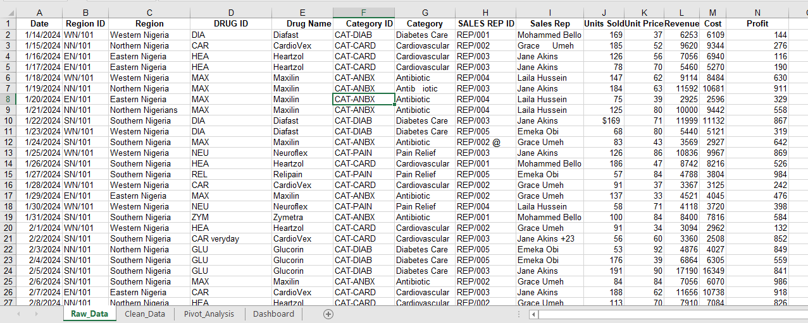
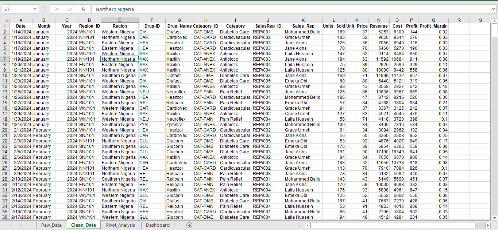
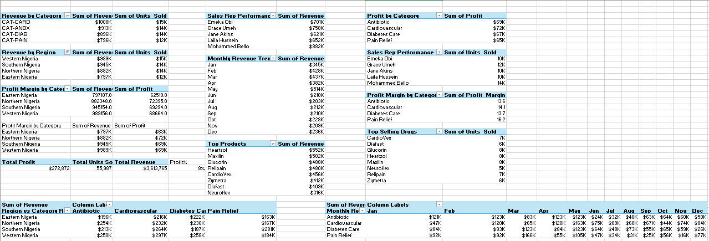

# MedRx Pharmacy Sales Analysis Dashboard

> An interactive Excel-based business intelligence dashboard analyzing pharmaceutical sales performance across four Nigerian regions — built with raw transaction data, manual data cleaning, Pivot Tables, and fully designed dashboards.

---

##  Dashboard Previews

###  Sales Intelligence — Revenue & Trend Overview


###  Market Pulse — Product Intelligence & Seasonal Demand


---

## Project Overview

**MedRx** is a pharmacy sales analytics project designed to uncover revenue performance patterns, regional drug demand, sales rep efficiency, and seasonal consumption dynamics across Nigeria's pharmaceutical retail landscape.

The project covers **2024–2025 fiscal data** spanning **502 transactions**, **8 drug SKUs**, **4 product categories**, **4 geographic regions**, and **5 sales representatives**.

---

##  File Structure

```
 MedRx-Pharmacy-Sales-Analysis
├── Pharmacy_Sales_Analysis.xlsx
│   ├── Raw_Data           ← Original unprocessed transaction log
│   ├── Clean_Data         ← Transformed & standardized dataset
│   ├── Pivot_Analysis     ← All aggregated pivot summaries
│   ├── Sales Intelligence ← Dashboard 1 (KPIs, trends, regional breakdown)
│   └── Market Pulse       ← Dashboard 2 (Top drugs, seasonal demand, rep performance)
├── Raw_Data.png
├── Cleaned_Data.png
├── Pivot_Table.png
├── Sales_Intelligence.png
├── Market_Pulse.png
└── README.md
```

---

## Sheet 1 — Raw Data



The **Raw_Data** sheet is the original, unprocessed transaction log as it was collected. It contains **14 columns** and intentionally includes real-world data quality issues that needed to be resolved before analysis.

**Columns in Raw_Data:**

| Column | Description |
|---|---|
| `Date` | Transaction date |
| `Region ID` | Regional code (e.g., WN/101, NN/101) |
| `Region` | Geographic region name |
| `DRUG ID` | Short drug identifier code |
| `Drug Name` | Product name |
| `Category ID` | Drug class code |
| `Category` | Drug class name |
| `SALES REP ID` | Sales representative code |
| `Sales Rep` | Representative's full name |
| `Units Sold` | Quantity sold in transaction |
| `Unit Price` | Price per unit |
| `Revenue` | Gross revenue |
| `Cost` | Cost of goods |
| `Profit` | Net profit |

**Data Quality Issues Found in Raw_Data:**

-  `"Northern Nigerians"` — incorrect region name (row 9)
-  `"Antib   iotic"` — extra whitespace inside category name (row 7)
-  `"CAR veryday"` — corrupted Drug ID entry (row 21)
-  `"Jane Akins +23"` — special characters appended to rep name (row 21)
-  `"REP/002 @"` — invalid character in Sales Rep ID (row 12)
-  `"$169"` — currency symbol embedded in a numeric Units Sold cell (row 10)
-  Missing derived columns: no `Month`, `Year`, or `Profit_Margin` fields

---

## Sheet 2 — Clean Data



The **Clean_Data** sheet is the transformed, analysis-ready version of the raw data. Every row represents one valid sales transaction. Three new derived columns were added and all inconsistencies from the raw sheet were corrected.

**Columns in Clean_Data (18 total):**

| Column | Description |
|---|---|
| `Date` | Transaction date |
| `Long Month` | Full month name (e.g., January) |
| `Month` | Abbreviated month (e.g., Jan) |
| `Year` | Fiscal year — 2024 or 2025 |
| `Region_ID` | Standardized regional code |
| `Region` | Cleaned geographic region name |
| `Drug-ID` | Standardized drug code |
| `Drug_Name` | Cleaned product name |
| `Category_ID` | Standardized category code |
| `Category` | Cleaned drug class name |
| `SalesRep_ID` | Standardized rep code |
| `Sales_Rep` | Cleaned representative name |
| `Units_Sold` | Numeric quantity sold |
| `Unit_Price` | Price per unit (₦) |
| `Revenue` | Gross revenue = Units × Unit Price |
| `Cost` | Cost of goods sold |
| `Profit` | Net profit = Revenue − Cost |
| `Profit_Margin` | Profit ÷ Revenue (decimal) |

**Cleaning Actions Applied:**

- Fixed inconsistent region names (`"Northern Nigerians"` → `"Northern Nigeria"`)
- Stripped extra whitespace from drug names and category labels
- Removed special characters from Sales Rep IDs and names
- Corrected corrupted Drug ID entries
- Converted currency-formatted cells to clean numeric values
- Normalized all column headers with underscores (no spaces)
- Added `Long Month`, `Month`, `Year`, and `Profit_Margin` as derived columns

**Key Dataset Stats:**

| Metric | Value |
|---|---|
| Total Transactions | 502 |
| Avg Units per Transaction | ~112 units |
| Avg Revenue per Transaction | ₦7,199 |
| Avg Profit Margin | ~11.5% |
| Max Single-Transaction Revenue | ₦18,600 |

---

## Sheet 3 — Pivot Analysis



The **Pivot_Analysis** sheet contains all aggregated summary tables that power the dashboard charts and KPI cards. Each pivot table slices the cleaned data by a different business dimension.

**Pivot Tables Included:**

| Pivot Table | Metrics |
|---|---|
| Revenue by Category | Sum of Revenue, Sum of Units Sold |
| Revenue by Region | Sum of Revenue, Sum of Units Sold |
| Sales Rep Performance | Sum of Revenue, Sum of Units Sold |
| Profit by Category | Sum of Profit |
| Profit Margin by Category | Sum of Profit Margin |
| Monthly Revenue Trend | Sum of Revenue (Jan–Dec) |
| Top Products | Sum of Revenue ranked by drug |
| Top Selling Drugs | Sum of Units Sold ranked by drug |
| Region × Category Revenue | Cross-tab of Revenue by Region and Drug Class |
| Monthly Category Trend | Revenue by Drug Class across all 12 months |
| Total Summary | Total Profit · Total Units Sold · Total Revenue · Overall Profit % |

**Pivot Summary Highlights:**

| Metric | Leader | Value |
|---|---|---|
| Top Revenue Category | CAT-CARD (Cardiovascular) | ₦1,008K |
| Top Revenue Region | Western Nigeria | ₦989K |
| Top Sales Rep (Revenue) | Mohammed Bello | ₦882K |
| Top Sales Rep (Units) | Mohammed Bello | 14K units |
| Top Drug by Revenue | Heartzol | ₦552K |
| Top Drug by Units Sold | Heartzol | 8K units |
| Highest Profit Margin Category | Pain Relief | 16.2% |
| Total Revenue | — | ₦3,613,765 |
| Total Profit | — | ₦272,872 |
| Overall Profit Margin | — | 8% |

---

## Dashboard 1 — Sales Intelligence


The **Sales Intelligence** dashboard provides a high-level executive overview of revenue, profit, and regional performance.

**KPI Cards (with YoY comparison)**
- **Revenue:** ₦3,613,765 — ▼ 56.6% vs Prior Year
- **Units Sold:** 55,987 — ▼ 58.2% vs Prior Year
- **Profit:** ₦272,872 — ▼ 57.3% vs Prior Year
- **Profit Margin:** 8% — ▼ 52.4% vs Prior Year

**Charts Included**
- Monthly Revenue Trend (Jan–Dec line chart)
- Regional Drug Category Revenue (grouped bar by region and category)
- Revenue & Units Sold by Region (Western Nigeria leads at ₦989K)
- Sales Rep Performance (donut chart — Mohammed Bello leads at ₦882K)
- Revenue & Units Sold by Category (CAT-CARD tops at ₦1,008K)

**Slicers:** Month · Sales Rep · Year Toggle (2024 / 2025)

---

## Dashboard 2 — Market Pulse


The **Market Pulse** dashboard focuses on product-level intelligence and seasonal demand behavior.

**Charts Included**
- Top Selling Drugs (bar chart — Heartzol leads at ₦552K)
- Revenue vs Profit Scatter by Region
- Seasonal Drug Demand Pattern (monthly heatmap table across 4 drug classes)

**Seasonal Demand Highlights (Units)**

| Drug Class | Peak Month | Trough Month |
|---|---|---|
| Antibiotic | January (121K) | June (23K) |
| Cardiovascular | May (163K) | October (44K) |
| Diabetes Care | May (123K) | December (25K) |
| Pain Relief | March (166K) | September (25K) |

**Slicers:** Month · Sales Rep · Year Toggle (2024 / 2025)

---

## Key Insights

1. **Revenue declined sharply YoY** — all four KPIs fell over 50%, signaling a significant contraction in 2025 vs 2024.
2. **Heartzol (Cardiovascular)** is the top-grossing drug at ₦552K, followed closely by Maxilin (Antibiotic) at ₦502K.
3. **Western Nigeria** generates the highest regional revenue (₦989K); Eastern Nigeria has the lowest at ₦797K.
4. **Mohammed Bello** leads all sales reps at ₦882K revenue; Emeka Obi is lowest at ₦701K.
5. **Pain Relief peaks sharply in March** (166K units), likely tied to dry-season health patterns.
6. **Antibiotic demand collapses in June** (23K units), indicating a strong post-infection-season drop-off.
7. **CAT-CARD (Cardiovascular)** is the highest-grossing category at ₦1.008M across all regions.
8. **Pain Relief has the highest profit margin** at 16.2%, despite not being the top revenue category.

---

## Tools Used

| Tool | Purpose |
|---|---|
| Microsoft Excel | Data storage, cleaning, pivot analysis, and dashboard design |
| Pivot Tables | Aggregation by region, category, rep, and month |
| Excel Charts | Bar, line, scatter, and donut visualizations |
| Slicers & Toggle Buttons | Interactive filtering by month, rep, and year |
| Manual Data Cleaning | Fixing raw data errors directly in Excel |

---

## How to Use

1. **Download** `Pharmacy_Sales_Analysis.xlsx`
2. Open in **Microsoft Excel 2016 or later** for full slicer and pivot support
3. Navigate to the **Sales Intelligence** or **Market Pulse** tabs for the interactive dashboards
4. Use the **Month** and **Sales Rep** slicers on the left panel to filter all visuals
5. Toggle between **2024** and **2025** using the year buttons in the top-right corner
6. Explore **Pivot_Analysis** to review the underlying aggregation tables
7. Compare **Raw_Data** and **Clean_Data** to trace every data quality fix applied

---

## 📬 Contact

Have questions or feedback? Feel free to open an issue or reach out via GitHub Discussions.

---

*Built using Microsoft Excel | Data: Nigerian Pharmaceutical Retail (Simulated)*
